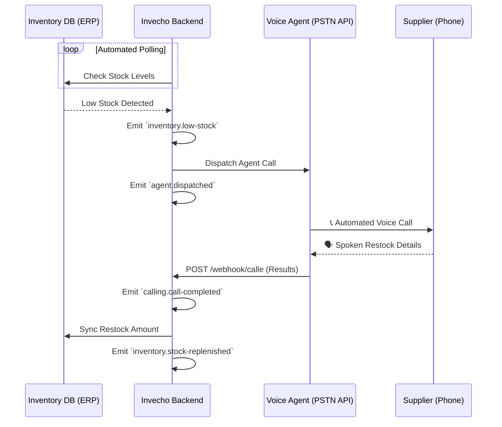

# Invecho: Autonomous PSTN Voice Agent for Supply Chains

Welcome to **Invecho**, a fully autonomous, voice-driven AI solution designed to revolutionize supply chain management. Invecho bridges the digital and physical worlds by actively monitoring your inventory and automatically dispatching a voice-based AI agent to negotiate and restock supplies over a standard PSTN phone call.

> [!TIP]
> **Why Invecho?**
> Supply chain management is often plagued by manual tasks—checking inventory levels, calling vendors during business hours, and manually updating databases. Invecho completely automates this procurement loop. 

---

## 🏗️ Architecture & Business Flow

Invecho employs an event-driven architecture that responds to inventory thresholds in real-time. When a low-stock alert is triggered, our system automatically calls your suppliers, negotiates restock amounts via natural conversation, and syncs the results directly into the ERP.



---

## 📚 Feature Specifications

To dive deeper into how each component of Invecho is architected and the business value it delivers, explore our dedicated feature documentation:

1. **[Automated Stock Polling](docs/features/automated-stock-polling.md)**
   How the system tracks and identifies inventory deficits.
2. **[Agent Dispatching](docs/features/agent-dispatching.md)**
   How Invecho initiates outbound PSTN calls to vendors.
3. **[Call-E Webhook Ingestion](docs/features/call-e-webhook-ingestion.md)**
   How spoken supplier responses are converted into structured webhook payloads.
4. **[ERP Stock Synchronization](docs/features/erp-stock-synchronization.md)**
   How the system updates your database to close the procurement loop automatically.

---

## 🛠️ Technology Stack

Invecho is built as a highly robust and scalable **Modular Monolith** using modern backend and frontend technologies.

| Layer | Technology | Purpose |
|-------|------------|---------|
| **Backend Framework** | [NestJS](https://nestjs.com/) | Powerful, extensible Node.js framework using TypeScript. |
| **Database ORM** | [Prisma](https://www.prisma.io/) | Type-safe database access for high-speed development. |
| **Architecture Pattern** | Event-Driven | Decoupled domains communicating via internal events (`EventEmitter2`). |
| **Frontend Framework** | [Angular](https://angular.dev/) | Enterprise-grade UI structure and robust tooling. |
| **Styling** | [Tailwind CSS](https://tailwindcss.com/) | Utility-first CSS for rapid, modern UI building. |

---

## 🚀 Quickstart Guide

Get Invecho running locally in a few minutes.

### Prerequisites

- Node.js (v18+)
- Docker & Docker Compose
- Environment variables configured (see `.env.example`)

### Installation & Setup

1. **Clone the repository**
   ```bash
   git clone https://github.com/HeriCraft/invecho.git
   cd invecho
   ```

2. **Run the setup script**
   We have provided convenient setup scripts to install dependencies and configure your environment.
   - For Windows (PowerShell):
     ```powershell
     ./setup.ps1
     ```
   - For Linux / macOS (Bash):
     ```bash
     ./setup.sh
     ```

3. **Start the services via Docker Compose**
   ```bash
   docker-compose up -d
   ```

4. **Run the application**
   Navigate to the backend and frontend directories in separate terminal windows and run:
   ```bash
   npm run start:dev
   ```

> [!NOTE]
> The backend defaults to `http://api.invecho.local` and the frontend defaults to `http://app.invecho.local` (depending on your local domain configuration).

---
*Built for modern, automated supply chain management.*
