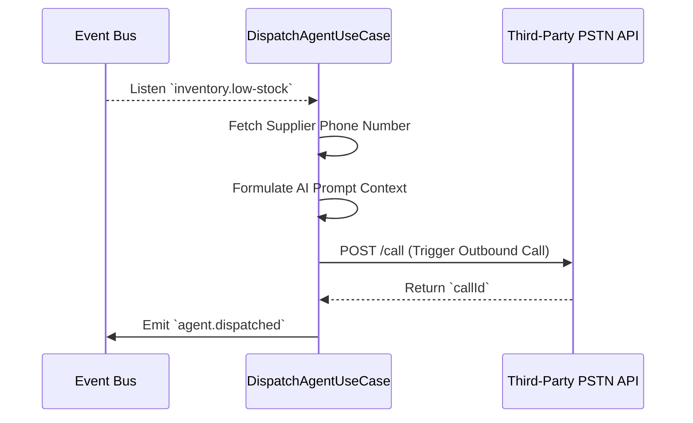

# Agent Dispatching

## Functional Overview

The **Agent Dispatching** mechanism is where Invecho moves from passive observation to active engagement. Once the system is notified that a product is running low, it doesn't just send an email—it literally picks up the phone.

The dispatch module prepares the necessary context (which supplier to call, what product is low, and how many items are needed) and instructs our AI Voice Agent via the PSTN API to place an outbound phone call. The voice agent conducts a human-like negotiation with the vendor's representatives to fulfill the order.

## Business Value

> [!TIP]
> **Zero-Friction Procurement**
> By automating the vendor outreach process, procurement teams no longer have to spend hours on hold or playing phone tag with suppliers.

- **Immediate Action**: The call is placed seconds after the threshold is breached, shrinking procurement lead times.
- **Scalability**: Capable of placing hundreds of simultaneous calls if a systemic shortage occurs.
- **Auditability**: Every call is tracked with a unique `callId`, ensuring absolute traceability.

## Technical Specification

The Agent Dispatching logic resides in the **Calling** module. It operates strictly as an event listener, waiting for instructions from the domain.

### Sequence Flow



### Event Contract

Once the call is successfully initiated with the telephony provider, the system acknowledges the dispatch.

**Event Name**: `agent.dispatched`

**Event Payload (`IAgentDispatchedEvent`)**:
```typescript
{
  callId: string;           // Provider's unique telephony ID
  productId: string;        // Product being ordered
  supplierId: string;       // Target supplier identifier
  timestamp: string;        // ISO-8601 string of when call started
}
```

The system now waits for the call to finish. The results of the call are captured via the [Call-E Webhook Ingestion](call-e-webhook-ingestion.md) process.
