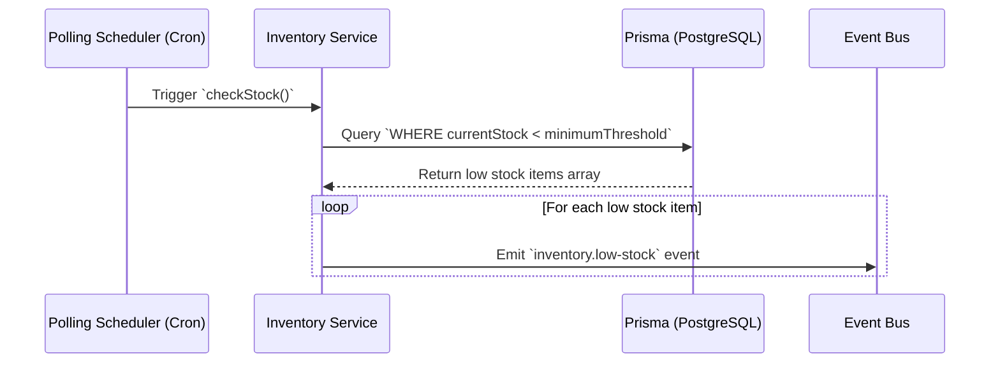

# Automated Stock Polling

## Functional Overview

The **Automated Stock Polling** feature acts as the eyes of the Invecho system. Instead of relying on warehouse managers to manually check inventory databases and compile shortage reports, Invecho proactively monitors stock levels at predefined intervals. It continuously compares the current on-hand quantity of every product against a configured minimum threshold. As soon as a product's stock dips below this threshold, the system flags it for immediate restock action.

## Business Value

> [!TIP]
> **Proactive Procurement & Zero Downtime**
> Stockouts can halt production lines or delay customer shipments, leading to lost revenue and damaged reputation. 

Automated stock polling guarantees that your supply chain operates proactively rather than reactively. By mathematically analyzing stock levels, businesses gain:
- **Reduced Labor Costs**: Eliminates the need for manual stock auditing.
- **Optimized Inventory**: Prevents overstocking while ensuring you never run out of critical materials.
- **Faster Response Times**: Restock procedures are initiated the exact second an item falls below the safety threshold.

## Technical Specification

The Automated Stock Polling is localized within the **Inventory** module of our NestJS backend. 

### Sequence Flow



### Event Contract

When a deficit is detected, the system decouples the detection logic from the alerting/calling logic by emitting an internal domain event. 

**Event Name**: `inventory.low-stock`

**Event Payload (`ILowStockDetectedEvent`)**:
```typescript
{
  productId: string;        // The unique identifier of the product
  currentStock: number;     // The exact number currently available
  threshold: number;        // The minimum required stock level
  supplierId: string;       // The ID of the supplier to contact for restock
}
```

This event is asynchronously handled by the **Calling** module to begin the next phase of the process: [Agent Dispatching](agent-dispatching.md).
