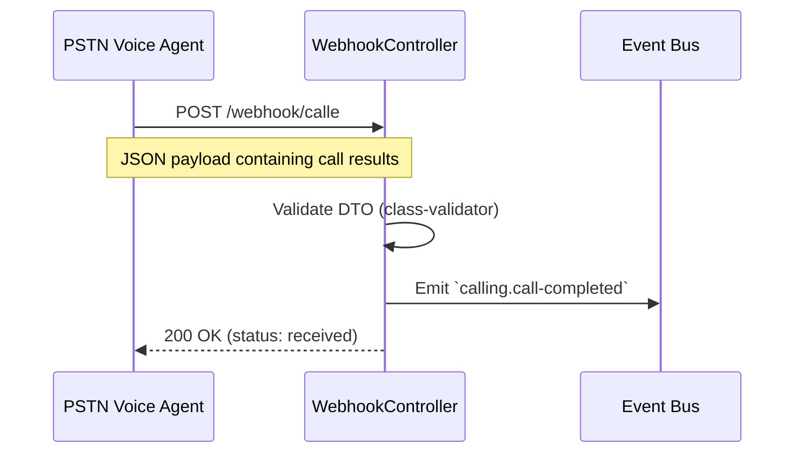

# Call-E Webhook Ingestion

## Functional Overview

Once the Invecho AI agent finishes its spoken conversation with the supplier on the phone, the results of that conversation must be communicated back to our system. The **Call-E Webhook Ingestion** feature handles this critical handoff. 

The PSTN AI analyzes the audio of the call, understands whether the supplier agreed to send the required items, extracts the exact quantity the supplier confirmed they will send, and posts this data back to our secure webhook endpoint as a clean JSON package.

## Business Value

> [!IMPORTANT]
> **Bridging the Physical and Digital Worlds**
> Spoken conversations are highly unstructured data. The true power of Invecho is turning a messy human phone call into structured, actionable data that a database can understand.

- **Eliminates Data Entry**: No human needs to listen to call recordings or type in negotiated amounts.
- **Instantaneous Updates**: The moment the phone hangs up, the data is ingested and ready for processing.
- **Standardized Contracting**: Every interaction with a supplier is boiled down to a strict success/failure state with explicit quantities.

## Technical Specification

The Webhook ingestion layer is exposed via the **Calling** module's infrastructure, specifically the `WebhookController`.

### Sequence Flow



### Webhook API Contract

**Endpoint**: `POST /webhook/calle`

**Payload (`WebhookPayloadDto`)**:
```typescript
{
  "callId": string,          // Must match the ID from agent.dispatched
  "productId": string,       // The product that was negotiated
  "status": "success" | "failed", // Outcome of the negotiation
  "restockAmount": number    // The exact quantity the supplier agreed to ship
}
```

### Internal Event Emitted

After successful ingestion and validation of the payload, the Calling module passes the baton back to the core system.

**Event Name**: `calling.call-completed`

**Payload (`ICallCompletedEvent`)**:
*(Identical mapping to the WebhookPayloadDto properties above)*

This event directly triggers the final step of the lifecycle: [ERP Stock Synchronization](erp-stock-synchronization.md).
