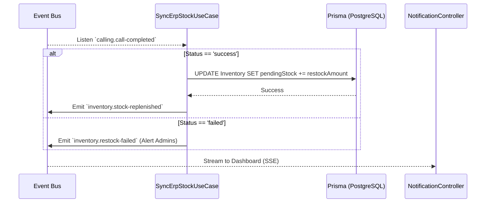

# ERP Stock Synchronization

## Functional Overview

The final step in the Invecho lifecycle is **ERP Stock Synchronization**. After the voice agent successfully negotiates a restock with a supplier and the results are ingested via webhook, this module securely updates the primary database. 

It calculates the new pending inventory level by taking the current stock and adding the `restockAmount` promised by the vendor on the phone call. This guarantees that subsequent polling cycles do not trigger duplicate calls to the supplier for the same product deficit.

## Business Value

> [!TIP]
> **Closing the Autonomous Loop**
> An autonomous system is only as good as its memory. By syncing the results directly to the database, Invecho ensures total system consistency.

- **Prevents Duplicate Orders**: Immediate synchronization ensures the stock-polling mechanism knows inventory is on its way, preventing redundant supplier harassment.
- **Accurate Forecasting**: Operations teams viewing the dashboard see a real-time reflection of pending inbound stock.
- **Hands-Free Compliance**: The entire lifecycle—from detecting a deficit to updating the ledger—occurs with zero manual data entry.

## Technical Specification

Synchronization logic resides in the **Inventory** module's application layer, specifically responding to events fired by the Webhook ingestion phase.

### Sequence Flow



### Event Contract

When synchronization completes successfully, the system broadcasts a final confirmation event, primarily utilized by the frontend dashboard via Server-Sent Events (SSE).

**Event Name**: `inventory.stock-replenished`

**Payload (`IStockReplenishedEvent`)**:
```typescript
{
  productId: string;        // Product that was restocked
  amountAdded: number;      // Quantity successfully ordered
  newTotalPending: number;  // Updated pending total in DB
}
```

This completes the entire Invecho procurement loop. The system returns to passive [Automated Stock Polling](automated-stock-polling.md).
